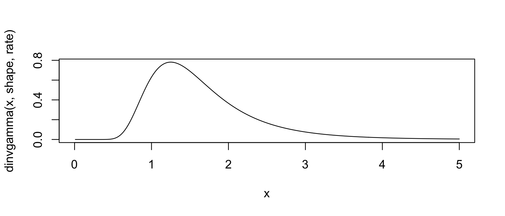
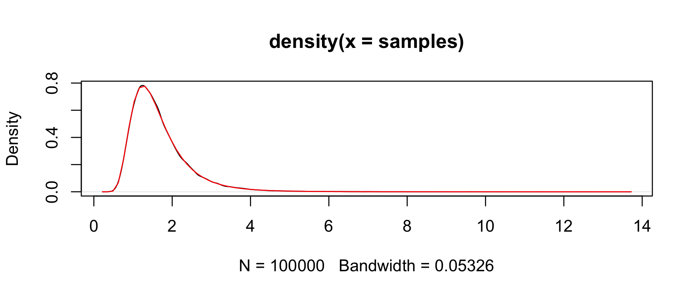

<!-- README.md is generated from README.Rmd. Please edit that file -->
**invgamma**
============

**invgamma** implements the `(d/p/q/r)` statistics functions for the [inverse gamma distribution](https://en.wikipedia.org/wiki/Inverse-gamma_distribution) in [R](http://cran.r-project.org). It is ideal for using in other packages since it is lightweight and leverages the `(d/p/q/r)gamma()` line of functions maintained by CRAN.

### Getting **invgamma**

There are two ways to get **invgamma**. For the [CRAN version](https://cran.r-project.org/package=invgamma), use

``` r
install.packages("invgamma")
```

For the development version, use

``` r
# install.packages("devtools")
devtools::install_github("dkahle/invgamma")
```

### The `(d/p/q/r)invgamma()` functions

The functions in **invgamma** match those for the gamma distribution provided by the **stats** package. Namely, it uses as its density *f(x) = (b^a / Gamma(a)) x^-(a+1) e^(-b/x),* where a = `shape` and b = `rate`.

The [PDF](https://en.wikipedia.org/wiki/Probability_density_function) (the *f(x)* above) can be evaluated with the `dinvgamma()` function:

``` r
library(invgamma)
library(ggplot2); theme_set(theme_bw())
x <- seq(0, 5, .01)
qplot(x, dinvgamma(x, 7, 10), geom = "line")
#  Warning: Removed 1 rows containing missing values (geom_path).
```



The [CDF](https://en.wikipedia.org/wiki/Cumulative_distribution_function) can be evaluated with the `pinvgamma()` function:

``` r
f <- function(x) dinvgamma(x, 7, 10)
q <- 2
integrate(f, 0, q)
#  0.7621835 with absolute error < 7.3e-05
(p <- pinvgamma(q, 7, 10))
#  [1] 0.7621835
```

The [quantile function](https://en.wikipedia.org/wiki/Quantile_function) can be evaluated with `qinvgamma()`:

``` r
qinvgamma(p, 7, 10) # = q
#  [1] 2
```

And random number generation can be performed with `rinvgamma()`:

``` r
set.seed(1)
rinvgamma(5, 7, 10)
#  [1] 1.9996157 0.9678268 0.9853343 1.3157697 3.1578177
```

`rinvgamma()` can be used to obtain a [Monte Carlo](https://en.wikipedia.org/wiki/Monte_Carlo_method) estimate of the probability given by `pinvgamma()` above:

``` r
samples <- rinvgamma(1e5, 7, 10)
mean(samples <= q)
#  [1] 0.7621
```

Moreover, we can check the consistency and correctness of the implementation with

``` r
qplot(samples, geom = "density") + 
  stat_function(fun = f,  color = "red")
```



### The `(d/p/q/r)invchisq()` and `(d/p/q/r)invexp()` functions

The [gamma distribution](https://en.wikipedia.org/wiki/Gamma_distribution) subsumes the [chi-squared](https://en.wikipedia.org/wiki/Chi-squared_distribution) and [exponential](https://en.wikipedia.org/wiki/Exponential_distribution) [distributions](https://en.wikipedia.org/wiki/Probability_distribution#Continuous_probability_distribution), so it makes sense to include the `*invchisq()` and `*invexp()` functions in **invgamma**. Their implementations, however, wrap `*chisq()` and `*exp()`, not `*invgamma()`.
