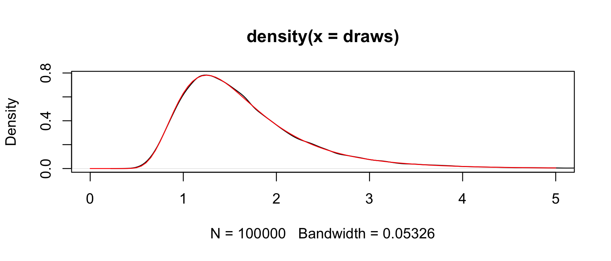

<!-- README.md is generated from README.Rmd. Please edit that file -->

# **invgamma**

<!-- badges: start -->

[](https://app.codecov.io/gh/dkahle/invgamma)
<!-- badges: end -->

**invgamma** implements the `[dpqr]` statistics functions for the
[inverse gamma
distribution](https://en.wikipedia.org/wiki/Inverse-gamma_distribution)
in [R](http://cran.r-project.org). It is ideal for using in other
packages since it is lightweight and leverages the `[dpqr]gamma()` line
of functions maintained by CRAN.

*Please see the section on parameterizations below to avoid any
unintended mistakes!*

### Getting **invgamma**

There are two ways to get **invgamma**. For the [CRAN
version](https://cran.r-project.org/package=invgamma), use

``` r
install.packages("invgamma")
```

For the development version, use

``` r
# install.packages("devtools")
devtools::install_github("dkahle/invgamma")
```

### The `[dpqr]invgamma()` functions

The functions in **invgamma** match those for the gamma distribution
provided by the **stats** package. Namely, it uses as its density *f(x)
= (b^a / Gamma(a)) x^-(a+1) e^(-b/x),* where a = `shape` and b = `rate`.

The [PDF](https://en.wikipedia.org/wiki/Probability_density_function)
(the *f(x)* above) can be evaluated with the `dinvgamma()` function:

``` r
library("invgamma")
x <- seq(0, 5, .01)
shape <- 7; rate <- 10
plot(x, dinvgamma(x, shape, rate), type = "l")
```

<!-- -->

The
[CDF](https://en.wikipedia.org/wiki/Cumulative_distribution_function)
can be evaluated with the `pinvgamma()` function:

``` r
f <- function(x) dinvgamma(x, shape, rate)
q <- 2

integrate(f, 0, q)
#  0.7621835 with absolute error < 7.3e-05

(p <- pinvgamma(q, shape, rate))
#  [1] 0.7621835
```

The [quantile function](https://en.wikipedia.org/wiki/Quantile_function)
can be evaluated with `qinvgamma()`:

``` r
qinvgamma(p, shape, rate) # = q
#  [1] 2
```

And random number generation can be performed with `rinvgamma()`:

``` r
set.seed(1234)
rinvgamma(5, shape, rate)
#  [1] 2.640734 1.364965 1.342591 2.095975 1.273201
```

`rinvgamma()` can be used to obtain a [Monte
Carlo](https://en.wikipedia.org/wiki/Monte_Carlo_method) estimate of the
probability given by `pinvgamma()` above:

``` r
n <- 1e5
draws <- rinvgamma(n, shape, rate)
mean(draws <= q)
#  [1] 0.76401
```

Moreover, we can check the consistency and correctness of the
implementation with first a [kernel density
estimate](https://en.wikipedia.org/wiki/Kernel_density_estimation)…

``` r
plot(density(draws), xlim = c(0,5))
curve(f(x), col = "red", add = TRUE)
```

<!-- -->

…and also a [quantile plot](https://en.wikipedia.org/wiki/Q–Q_plot)…

``` r
qqplot( "x" = ppoints(n) |> qinvgamma(shape, rate), "y" = draws,
  xlab = "Theoretical quantiles", ylab = "Sample quantiles",
  main = "QQ plot for inverse gamma draws"
)
abline(0, 1, col = "red")
```

<!-- -->

Both of these indicate that the samplers are consistent. As an
inferential alternative, we can use a [KS
test](https://en.wikipedia.org/wiki/Kolmogorov–Smirnov_test):

``` r
ks.test(
  draws, 
  function(p) pinvgamma(p, shape, rate)
)
#  
#   Asymptotic one-sample Kolmogorov-Smirnov test
#  
#  data:  draws
#  D = 0.0029822, p-value = 0.3361
#  alternative hypothesis: two-sided
```

### The `[dpqr]invchisq()` and `[dpqr]invexp()` functions

The [gamma
distribution](https://en.wikipedia.org/wiki/Gamma_distribution) subsumes
the
[chi-squared](https://en.wikipedia.org/wiki/Chi-squared_distribution)
and
[exponential](https://en.wikipedia.org/wiki/Exponential_distribution)
[distributions](https://en.wikipedia.org/wiki/Probability_distribution#Continuous_probability_distribution),
so it makes sense to include the `*invchisq()` and `*invexp()` functions
in **invgamma**. Their implementations, however, wrap `*chisq()` and
`*exp()`, not `*invgamma()`.

### A note on parameterizations

As detailed [here](https://github.com/dkahle/invgamma/issues/1), the
parameterizations of the functions in this package cue off of their
corresponding non-inverse distributions from **stats**. This commonly
causes the confusion that, for example, the parameter `rate` in
`dinvgamma()` is the rate parameter of the inverse gamma distribution.
It is not! It is the rate parameter of the corresponding gamma
distribution. Please take care with this distinction.

### A note on numerics

**invgamma** was intended to be a lightweight and simple, largely
self-maintaining package implementing the inverse gamma, inverse
chi-square, and inverse exponential distributions. It uses [the
transformation
theorem](https://en.wikipedia.org/wiki/Random_variable#Functions_of_random_variables)
in all cases.

One of the challenges to using naive implementations of distributions is
that their
[numerics](https://en.wikipedia.org/wiki/Floating-point_arithmetic) may
not work well. Arithmetic on a computer is not the same as arithmetic in
theory, the kind that you meet in math classes, and as a consequence the
best computer implementations of mathematical facts/algorithms need to
be tailored to the specific cases at hand.

In January 2023 I did a little poking around into this for `rinvgamma()`
and found that it performs poorly when the shape parameter is less than
.001 or so. The resulting distributions are very heavy-tailed, and the
draws from these distributions returned by `rinvgamma()` are so large
that they get rounded to either very large numbers (where the floating
point representation of numbers does not provide many numbers) or
infinity. Example:

``` r
rinvgamma(10, shape = .001, rate = 7)
#  Warning: `rinvgamma()` is unreliable for `shape` <= .01.
#   [1]           Inf           Inf 1.192692e+213           Inf 3.289218e+167
#   [6]           Inf           Inf 7.899428e+197  3.938612e+97           Inf
```

#### KS tests for sampling accuracy

##### `rinvgamma()`

Here is a more detailed Monte Carlo investigation that checks sampler
quality using [the Kolmogorov-Smirnov
test](https://en.wikipedia.org/wiki/Kolmogorov–Smirnov_test).

First, we write a basic Monte Carlo test for the sampler that works by
generating a large (`n = 1e6`) sample of draws from the inverse gamma
distribution for a given shape and rate:

``` r
test_invgamma <- function(shape, rate, n = 1e5) {
  draws <- rinvgamma(n, shape, rate)
  ks.test(draws, function(p) pinvgamma(p, shape, rate))$p.value
}

test_invgamma(3, 7)
#  [1] 0.3464601
```

The function returns the $p$-value associated with the KS test, so
“small” values suggest a departure from the null hypothesis that the
distribution is from the corresponding inverse gamma distribution: the
sampler is performing poorly. Under the null hypothesis, [the $p$-value
has an approximate uniform
distribution](https://en.wikipedia.org/wiki/P-value#p-value_as_the_statistic_for_performing_significance_tests),
a fact that can be found in most advanced mathematical statistics books,
so we would expect some proportion to be small regardless.

We want to see the behavior of the sampler `rinvgamma()` across a wide
array of parameter values. To do this, we use a range of parameter
values running from small ($10^-4$) to large ($10^4$):

``` r
# load tidyverse and related
library("tidyverse"); library("patchwork"); library("scales", warn.conflicts = FALSE)
theme_set(theme_minimal()); theme_update(panel.grid.minor = element_blank())

# load furrr for parallel computing
library("furrr"); furrr_options(seed = TRUE)
#  <furrr_options>
plan(multisession(workers = parallelly::availableCores()))

# set parameter values to test
n_grid <- 51
param_vals <- 10^seq(-4, 4, length.out = n_grid)
(param_grid <- expand_grid("shape" = param_vals, "rate" = param_vals))
#  # A tibble: 2,601 × 2
#      shape     rate
#      <dbl>    <dbl>
#   1 0.0001 0.0001  
#   2 0.0001 0.000145
#   3 0.0001 0.000209
#   4 0.0001 0.000302
#   5 0.0001 0.000437
#   6 0.0001 0.000631
#   7 0.0001 0.000912
#   8 0.0001 0.00132 
#   9 0.0001 0.00191 
#  10 0.0001 0.00275 
#  # ℹ 2,591 more rows
```

Here’s what the experiment’s design space looks like:

``` r
# make axes labeller
fmt <- scales::math_format(10^.x)

# make plot
ggplot(param_grid, aes(shape, rate)) +
  geom_point() +
  scale_x_log10(expression(alpha), n.breaks = 10, labels = fmt(-5:5)) +
  scale_y_log10(expression(lambda), n.breaks = 10, labels = fmt(-5:5)) +
  labs("title" = "Parameter Values at Which to Test `rinvgamma()`") +
  coord_equal()
```

<!-- -->

Now, we run our test for each point in the design space in parallel.
(Note: we’ve suppressed warnings here that are relevant.)

``` r
param_grid <- param_grid |> 
  mutate(p_val = future_map2_dbl(shape, rate, test_invgamma))
```

And we visualize the distribution of the $p$-values over that space,
binning the colors to at .05 to highlight the rejections of the tests at
the 5% level:

``` r
ggplot(param_grid, aes(shape, rate, color = p_val)) +
  geom_point() +
  scale_x_log10(expression(alpha), n.breaks = 10, labels = fmt(-5:5)) +
  scale_y_log10(expression(lambda), n.breaks = 10, labels = fmt(-5:5)) +
  scale_color_binned(breaks = c(0, .05, 1)) +
  labs(color = "p value") +
  labs("title" = "KS GoF Test of Draws for Different Parameter Values") +
  coord_equal()
```

<!-- -->

If the sampler were working correctly, the $p$-values would be
approximately IID uniform(0,1), so we would expect about 5% of the
points to be purple, and those 5% would be uniformly distributed over
the whole space with no patterns. Obviously, that’s not the case: when
the shape parameter is small, the test is always rejecting. Clearly,
when `shape` is small, the sampler does not work well. Further
investigations reveal that, as an easy rule, the sampler can be
considered unreliable for `shape` values less than `0.01`. As a
consequence, `rinvgamma()` issues a warning in those circumstances.
(This warning has been suppressed in the above computations.)

##### `rinvchisq()` and `rinvexp()`

Similar investigations using the inverse chi-squared and inverse
exponential reveal that `rinvchisq()` should not be trusted when
`df <= .01` and `ncp <= 10` and `rinvexp()` is trustworthy for all
values. Here is the illustration for the inverse chi-squared:

``` r
test_rinvchisq <- function(df, ncp, n = 1e5) {
  draws <- rinvchisq(n, df, ncp)
  ks.test(draws, function(p) pinvchisq(p, df, ncp))$p.value
}

expand_grid("df" = param_vals, "ncp" = param_vals) |> 
  mutate("p_val" = future_map2_dbl(df, ncp, test_rinvchisq)) |> 
  ggplot(aes(df, ncp, color = p_val)) +
    geom_point() +
    scale_x_log10(expression(nu), n.breaks = 10, labels = fmt(-5:5)) +
    scale_y_log10("ncp", n.breaks = 10, labels = fmt(-5:5)) +
    scale_color_binned(breaks = c(0, .05, 1)) +
    labs(color = "p value") +
    coord_equal()
```

<!-- -->

And here is the illustration for the inverse exponential:

``` r
test_rinvexp <- function(rate, n = 1e5) {
  draws <- rinvexp(n, rate = rate)
  ks.test(draws, function(p) pinvexp(p, rate))$p.value
}

tibble("rate" = 10^seq(-4, 4, length.out = 2*n_grid)) |> 
  mutate("p_val" = future_map_dbl(rate, test_rinvexp)) |> 
  ggplot(aes(rate, 0, color = p_val)) +
    geom_point() +
    scale_x_log10(expression(lambda), n.breaks = 10, labels = fmt(-5:5)) +
    scale_color_binned(breaks = c(0, .05, 1), guide = FALSE) +
    theme(axis.text.y = element_blank(), axis.title.y = element_blank(),
          panel.grid.major.y = element_blank()) +
    coord_equal()
```

<!-- -->
